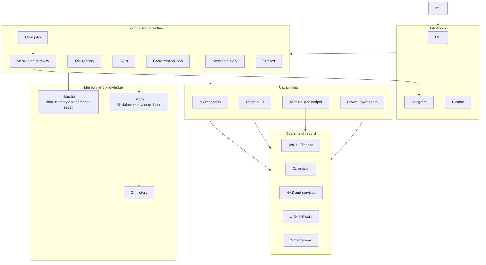
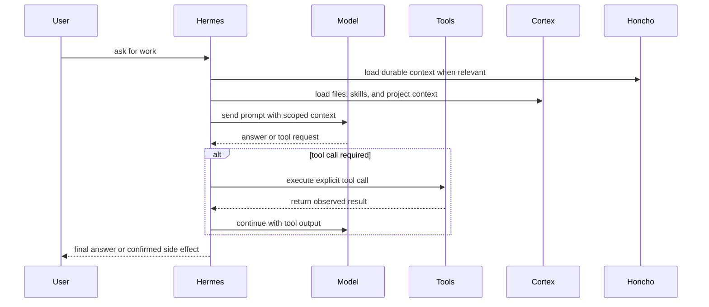

# The boring architecture behind a useful personal AI agent

I don't want an AI assistant because I think a chatbot should be my best friend. I want one because I'm lazy in a very specific, very engineered way.

I want the boring stuff handled. The repetitive checks done. Notes updated, calendars summarised, research digested, media tracked, home infrastructure queried, and the recurring junk I do every week turned into something I don't have to reassemble by hand every single time. I can't build a habit to save my life, so I'd rather build a system that doesn't need me to have one.

That's the actual motivation. None of this is about making something that feels alive. It's about making something that's useful, and usefulness is not something you get by slapping a nicer prompt in front of a model. A better prompt makes a model sound better, sure, but it doesn't give it memory, permissions, tools, logs, schedules, or a sane relationship with the filesystem.

So here's the thing I keep coming back to: a useful personal assistant is not one model and one prompt. It's a layered system. You've got a runtime for execution, memory for continuity, skills for learned procedures, local files for durable knowledge, tools for reaching real systems, schedulers for ambient work, permissions for safety, and logs so you can actually figure out what happened later.

The model is the reasoning engine sitting inside all of that. It is **not** the whole thing. Short version, the **LLM** is the **CPU**, and the architecture is the computer.

That distinction matters because most AI assistant demos still treat the model as the product, and I think that's backwards. The product is everything around the model. How it gets context, where it stores state, what it's allowed to touch, what it has to ask before doing, and how you debug it when it inevitably does something weird at 2am.

# Chatbots are not agents

A chatbot answers questions. An agent operates against a state. Sounds like a nothing difference until the assistant can read files, call APIs, run shell commands, send messages, update notes, poke at system metrics, schedule future work, or mutate external systems. At that point it stopped being a text box. It's an operator sitting right next to your infrastructure, and that's about as mission critical as it gets.

> That operator might be helpful. It might also be confidently, catastrophically wrong.

So the design problem changes, where now you actually start asking questions that matter:

- What's the source of truth?
- What state is durable, and what's temporary?
- Which tools are read-only, and which can mutate things?
- What needs confirmation before it runs?
- Where do the logs live?
- How do I recover from a bad action?
- Can I inspect what happened after the fact?
- Can I swap the model without rebuilding everything else?

This is where it becomes fun. Your system now will stop looking like a chat app and start looking like actual systems software, mostly because of the side effects. So repeat after me, **an agent with shell access is not a simple chatbot.**

# A few principles I built around

The stack I run is built on a handful of opinions, and I'll be upfront that they're opinions.

First, **local files win whenever they can**. Markdown notes, Git history, plain scripts, JSON caches, normal logs. None of it is pretty, but it survives time, which is exactly why I've never bought into storing notes in anything that isn't a text file (`.md` very much included). If the AI layer vanishes tomorrow, I still want my notes, drafts, research and operational history to be readable. And if I feel like it, I want to be able to rebuild the whole thing on a completely different stack.

Second, **live systems get queried through explicit tools and APIs**. If there's an API, use the API. If there's an MCP server, use the MCP server. Browser automation is occasionally useful, but it's also *a pile of timing assumptions wearing a trench coat*, and I hate it with the force of a thousand suns.

Third, **memory needs boundaries**. Not everything belongs in long-term memory. A preference might. A stable fact about my environment might. A temporary task, a PR number, a one-off reminder, or some emotional noise from a random Tuesday? No. Memory shouldn't grow in a straight line forever, it should get reviewed and trimmed down to what actually deserves to survive.

Fourth, **repeated procedures should become reusable procedures**. If I have to correct the assistant three times on how to do something, the answer is not "I hope it remembers next time". The answer is to write that workflow down as a skill. Hermes does this really well, more on that later.

Fifth, **scheduled work should be deterministic when it can be**. If a script can fetch calendar data, cache it and render a briefing, I don't need a language model in that path inventing a brand new failure mode for me. LLMs are great for synthesis and judgement, but they're not mandatory for every cron job. Most scheduled tasks are boring, mechanical work that a dumb little script handles fine (just get the AI to write the script).

And finally, **destructive actions need friction**. The assistant can be fast without being reckless. Autonomy is a dial here, not a switch, and I'm honestly still tuning where it sits (and will remain so, I don't think anyone has properly solved this yet).

# The whole thing at a glance

The stack has five main layers.

**Hermes** is the runtime, owning the conversation loop, the tool registry, skills, the gateway, the cron scheduler, profiles, delegation and model routing.

**Honcho** is memory and identity. It holds durable conclusions, a representation of me, and semantic recall that reaches beyond whatever's in the current prompt window.

**Cortex** is the knowledge base. It's an Obsidian vault backed by Markdown and Git. Long-form notes, drafts, reviews, research, daily notes and canonical pages all live there.

**MCP and the other tools** are the capability boundary. They expose finance data, the filesystem, the terminal, the web, home infrastructure and everything else through explicit calls.

**Cron and the gateway** are what make it ambient. I hit the CLI when I want precision, or Telegram when I just want a briefing or a quick answer from wherever I happen to be. Discord is a work in progress, it can fan messages out across channels, which is handy if you run your own server.

The split is honestly pretty simple. `Hermes` executes, `Honcho` remembers, `Cortex` preserves, tools connect, `cron` repeats. That's most of the architecture right there.

# Hermes, the runtime

Hermes is the agent runtime I use. I think of it less as "the assistant" and more as the process supervisor for the assistant. I tried Clawdbot too, and it's complicated and a bit of a security hell hole for my taste, so I prefer this one and I'll keep using it until something better for my use cases shows up.

It runs the loop:

1. build the prompt
2. call the model
3. inspect the tool calls
4. execute the tools
5. feed the results back into context
6. keep going until there's an answer or the task is done

That loop is the boring core of pretty much every agent system. The part I actually care about is that Hermes has provider-agnostic model routing, so the rest of the architecture isn't welded to a single vendor. It can use OpenAI, Anthropic, OpenRouter, a local model, or some custom endpoint depending on how I've configured it. That matters because models move fast, and the infrastructure shouldn't have to move with them every time.

Hermes also has toolsets. A session might have terminal tools, file tools, browser tools, web search, memory, scheduled jobs, messaging, MCP servers, the Wallet finance tools, and so on. Tool access is explicit, always, and that's the point. A tool is a capability, and capabilities should be gated behind human supervision and permission.

There are profiles too. A profile isolates configuration, sessions, skills and memory, which gives me separate userlands for different modes of operating. One context doesn't have to inherit every habit, tool and memory from another, and it also lets other people talk to my agents without dragging my whole setup along.

Then there's the gateway. The same agent runs in the terminal and on messaging platforms like Telegram or Discord. This is more useful than it sounds. The CLI is great when I'm working directly. Telegram is great when I want a briefing, a reminder, or a quick query from the couch.

And cron, which is what flips the assistant from reactive to ambient. Instead of only answering when I poke it, it can run scheduled work: fetch data, render briefings, send reminders, summarise research, check local systems, kick off a workflow.

The runtime metaphor actually holds up nicely. Tool calls are `syscalls`. Skills are installed procedures. Profiles are isolated userlands. And `cron` is `cron`, what else.

So Hermes isn't the assistant. Hermes is the runtime that lets the assistant exist in the first place.

# Honcho, memory and identity

Most "AI memory" systems make me nervous. Half the time "memory" means "we shoved text into a vector database and hoped vibes would emerge". That can work for retrieval, but it's not memory governance, and honestly it's too much complexity for my peanut brain. Remember, I'm lazy, I don't want to babysit a second moving part.

Honcho plays a different role here. It gives the assistant continuity across sessions by holding peer representations, durable conclusions and semantic context. It can keep a profile of me, a profile of the assistant, and recalled observations about how the system is put together.

That does not mean everything gets remembered. The stack keeps several kinds of state separate on purpose:

| State | What it's for |
|---|---|
| Current prompt | The immediate task and loaded context |
| Session history | What happened in a specific conversation |
| Session search | Finding previous conversations later |
| Honcho memory | Durable facts and identity-level context |
| Skills | Reusable procedures |
| Cortex | Human-readable long-form knowledge |
| External APIs | Current truth from live systems |

This matters a lot. Dump everything into long-term memory and memory becomes a landfill. Dump everything into the prompt and the context window balloons. Rely on the model to infer live state from old text and congratulations, *you've reinvented stale cache invalidation, the second hardest problem in computing.*

Good memory is curated. Things that belong in it:

- stable preferences
- durable environment facts
- long-lived constraints
- patterns that keep repeating
- identity-level context

Things that usually don't:

- temporary task progress
- branch names
- PR numbers
- one-off events
- stale operational facts
- raw private journal entries

The assistant can remember that I like local-first Markdown and least-privilege defaults. It should not permanently remember every half-finished task I mumbled about once, unless that task actually belongs in a project note or a todo list somewhere.

**Memory is only useful if it's curated.** Otherwise it just becomes food for hallucinations.

# Skills, procedural memory

Facts are not procedures. This is one of those places where agent systems love to smush two different concepts into one. A memory that says "the user uses Obsidian" is not the same thing as a procedure for creating, linking, indexing and logging a new Cortex note. One is a fact. The other is operational knowledge.

Hermes skills are procedural memory. A skill is a reusable playbook that can carry trigger conditions, exact commands, known pitfalls, verification steps and project-specific conventions.

In my setup, skills cover stuff like:

- operating Cortex and Obsidian notes
- using the Wallet finance MCP
- managing media backlog entries
- turning voice reviews into structured notes
- GitHub workflows
- debugging procedures
- test-driven development
- home infrastructure operations
- configuring Hermes itself

The goal is not to make the model "remember harder". The goal is to stop leaning on accidental prompt residue. When a workflow repeats, write it down as a skill, then load that skill the next time the task shows up.

Yes, it's dull. *Dull is good. Dull is how systems become reliable.* `KISS`, and let skills stop you from treating your prompt history like a database.

# Cortex, the local-first knowledge base

Cortex is my Obsidian vault living inside a Git repo. It's where long-form knowledge goes, and it's deliberately separate from agent memory. Cortex is not just another memory backend for the assistant, it's the human-owned knowledge substrate. Markdown is the storage, Obsidian is the UI, Git is the history and the undo button.

That gets me a few properties I really care about:

- Notes are readable without the assistant.
- Changes show up as diffs I can review.
- The whole thing can be backed up, branched, reverted and searched.
- The assistant can contribute without becoming the only way to read the content.

Cortex has a schema. Canonical pages sit under concepts, entities, comparisons, queries and projects. There are area notes for the ongoing stuff like homelab, finance, learning, work, health and home. Daily notes act as a low-friction write-ahead log. Raw sources get preserved separately. Reviews and media backlog entries have their own structure.

The important word is ownership. If the AI disappears tomorrow, the knowledge should still be useful. That single principle kills a lot of nonsense. The assistant can summarise research into Cortex, update a project note, add a media review, or append to a daily note, but the result is still a normal file. I can open it in Vim, Obsidian, VS Code, or whatever editor hasn't yet decided it needs an AI side panel and a login screen.

# MCP and tools, the capability boundary

MCP is good because it gives the assistant structured access to external systems. Tools have schemas. Capabilities can be discovered. Permissions can be scoped. I don't need a bespoke one-off integration for every single service.

The Wallet by BudgetBakers integration is a nice example. Wallet data comes through official MCP tools, so the assistant can query accounts, budgets, categories, records, labels and aggregations without scraping the web app or exporting my entire financial life into some cursed CSV ritual.

The read-only default matters here. Finance data is sensitive. I want analysis, summaries and answers. I do not want a model casually rewriting financial records unless I explicitly ask for it and the permissions actually allow it.

Same principle everywhere else. Network gear, NAS metrics, calendars, smart-home controls, GitHub repos. All of it should be exposed through narrow tools with clear, predictable behaviour. MCP helps with that, but it isn't magic. Security is the imperative here, and it's genuinely hard to get right sometimes.

# Cron, ambient automation

The system gets a lot more useful the moment it stops waiting for me to ask everything by hand.

Hermes cron jobs handle the scheduled work. Some jobs are model-driven, others are script-first, and for deterministic tasks the scripts win. My calendar briefing flow is a good example:

1. Read the private ICS feeds.
2. Cache the parsed data locally.
3. Render a deterministic daily briefing.
4. Deliver it over Telegram.
5. Fold in the Cortex daily-note reminders.

A model can help with synthesis where it's actually needed, but it does not need to sit in the critical path for fetching and rendering data I already know the shape of. Deterministic input should get deterministic handling.

This whole philosophy isn't anti-AI, it's just being sensible about the tools we already had before the hype cycle. Cron also handles reminders and recurring workflows. A pre-vacation reminder belongs in cron. A daily research digest belongs in cron. Infrastructure checks can live there too, depending on how noisy they get. The rule I keep returning to is simple: *use LLMs for judgement, synthesis and language, use scripts for deterministic machinery.*

# Personal infrastructure as an operating surface

The assistant gets more useful when it can see the same systems I already care about. In my case that's:

- a UniFi UDM Pro for network status, clients, topology and anomalies
- a Synology NAS for storage and self-hosted services
- Prometheus and Grafana for metrics and observability
- Wallet by BudgetBakers for finance data
- private ICS feeds for calendars
- Cortex for notes and knowledge
- Telegram and Discord for messaging
- a handful of smart-home devices where control actually makes sense (by the way, this freaking thing got into my Roomba and made it beep, so that was a fun afternoon)

I still check all of these myself. Having an assistant synthesise the information is useful, but I still want Prometheus scraping metrics, Grafana rendering dashboards, UniFi owning the network and Synology running its services. The assistant should query, summarise, connect dots and help me operate. It should not become the source of truth for everything, or, really, for anything.

# Security and trust boundaries

Any post about a personal agent with terminal, filesystem, network, finance and messaging access needs a security section. Otherwise it's just an incident report waiting to happen.

The model here is mostly about shrinking the blast radius:

- Prefer read-only integrations first.
- Use scoped accounts wherever you can.
- Keep secrets in environment and config files, not in notes.
- Require confirmation for destructive actions.
- Keep finance access read-only unless there's a deliberate reason not to.
- Use private calendar feeds instead of broad cloud API access when read-only data is enough.
- Keep Cortex changes reviewable through Git.
- Use profiles to isolate contexts.
- Keep memory curated.

There are tradeoffs all over the place. Gateway access is convenient, but it widens the interaction surface. Long-term memory is useful, but it can preserve bad assumptions. Tool access makes the assistant useful, but every tool grows the blast radius. Automation kills toil, but it can also repeat a mistake on a schedule, faithfully, forever.

This is exactly why I don't think "fully autonomous" is a useful goal on its own. Autonomous for what? Reading notes? Fine. Deleting data? Absolutely not. Moving money? Completely different conversation. Restarting a service? Depends which service, and what evidence it has that the restart is warranted. Autonomy should be scoped to the operation, and **"YOLO mode" is not a security model.**

# Human in the loop

I still want to be in the loop for anything high-impact. That doesn't mean the assistant has to ask permission before every read or every harmless note edit, because too much confirmation just turns automation into bureaucracy with a progress spinner. But the heavy stuff needs my sign-off, because I am **still** the boss around here:

- deleting files
- changing financial records
- modifying infrastructure
- pushing code
- sending messages that actually matter
- changing persistent memory
- touching credentials

Make the routine things easy and the dangerous things explicit. The nice part about local-first state is that review is just normal. Cortex changes show up as Git diffs, logs exist, sessions are searchable, cron jobs can be listed, tool outputs are visible. So when something goes sideways, and it will, I can usually reconstruct the state machine and figure out what the hell happened.

# What goes where

This is the table I wish more agent projects had drawn up before they started bolting on features.

| Layer | Stores | Use it for |
|---|---|---|
| Prompt context | Current task, loaded skills, immediate instructions | Short-term reasoning |
| Session history | Conversation transcript | Reconstructing a specific interaction |
| Session search | Indexed past conversations | Finding old decisions or context |
| Honcho | Durable facts, identity, stable preferences | Continuity across sessions |
| Skills | Procedures, commands, pitfalls | Repeated workflows |
| Cortex | Notes, drafts, research, reviews, projects | Human-readable durable knowledge |
| External APIs | Live system state | Current truth |
| Scripts/cache | Deterministic intermediate data | Reliable scheduled jobs |

The rule is simple. **Don't make the model infer state that a file, an API or a database can hand you deterministically.**

# Observability and debugging

If the assistant is infrastructure, it needs inspection points. For this stack that means:

- Hermes session history
- session search
- gateway logs
- cron job definitions and their outputs
- tool call outputs
- Git diffs in Cortex
- local scripts and caches
- Prometheus and Grafana for the home stuff

Not glamorous, but necessary. **You can't operate what you can't inspect**, and that applies to agents too, despite the industry's heroic commitment to vibes. The habit that actually saves me is verification. If the assistant writes a file, read it back. If it changes a repo, check the diff. If it claims a command succeeded, look at the status. If it sends data somewhere, verify the target.

# A normal day with this thing

The useful version of all this is not dramatic, and that's fine by me. In the morning, scheduled jobs pull calendar data from the private ICS feeds, render a briefing and drop it into Telegram, reminders from the Cortex daily note included.

During the day I just ask it things, from the CLI or from Telegram. It can search past sessions, inspect files, update notes, query Wallet data, or check on the home infrastructure.

If I ask it to do something repeated, that workflow can become a skill. If it learns a stable preference, that can become memory. If it produces durable synthesis, that goes into Cortex. If the task should recur, it becomes a cron job. That loop is the entire point:

- facts become memory
- procedures become skills
- knowledge becomes notes
- recurring work becomes schedules
- live truth stays in the systems that own it

The assistant is useful because it routes information to the right layer instead of stuffing everything into a prompt and praying the next completion behaves itself.

# Failure modes

This architecture still fails. It just fails in ways I can usually inspect, which is the whole bargain. The most dangerous failure is misplaced confidence, where the assistant sounds dead certain while running on stale memory, partial tool output, or a wrong assumption. That's exactly why I'm so picky about explicit sources of truth. Live state comes from live tools. Durable knowledge lives in files. Procedures live in skills. Memory only stores what's earned the right to survive.

There's also the ordinary entropy of personal infrastructure. Every integration is a dependency, and every dependency has opinions, some of which were written into firmware by people who really should have gone for a walk first. It is what it is, and we deal with it. The answer isn't to avoid integrations, it's to keep them boring, inspectable and scoped.

# Lessons learned

The big one is that personal agents aren't really a model problem. They're a systems problem.

The model matters, obviously. Better reasoning, more context, better tool use, lower latency, all of it helps. But the architecture around the model is what decides whether it gets the right context, the right tools, the right constraints and a safe place to put its results.

The practical lessons are boring, which is usually how you know they're real:

- Prefer APIs over browser automation.
- Prefer read-only before write.
- Prefer local files for durable knowledge.
- Prefer Git for review and rollback.
- Prefer scripts for deterministic scheduled work.
- Prefer skills over repeating the same prompt correction.
- Prefer explicit memory over accidental memory.
- Prefer logs over trust.
- Verify side effects.
- Keep a human in the loop for destructive operations.

Less exciting than a "fully autonomous AI employee", I know. Also a lot less likely to delete your notes, leak your secrets, or quietly fail a scheduled task for three weeks because an `OAuth` token expired and nobody read the logs. **I'll take boring and useful over magical and fragile every single day.**

# Wrapping up

Hermes gives me the runtime. Honcho gives me continuity. Cortex gives me durable, human-readable knowledge. MCP and tools give me controlled access to real systems. Cron makes useful work happen without me asking. Git, logs and explicit permissions keep the whole thing from decaying into folklore.

The model still matters. It reasons, writes, summarises, plans and picks tools. But it's one component, not the system.

The architecture is what makes the assistant useful, and that's the part I actually care about. Not because it's flashy, but because it works. And because if a shell script, a Markdown file and a scoped API token solve the problem, I'd much rather do that than summon twelve microservices and a pitch deck.

# The parts I only sketched here

This post is the architecture map, not the full operating manual, and a few pieces deserve their own treatment because they're where the system stops being abstract and starts touching real life.

The homelab side is the physical substrate, the UniFi network, the NAS, the services on it, the monitoring scripts, the dashboards, and the mild paranoia that comes with letting software talk to devices in your house. Local-first doesn't mean "runs on my laptop and vibes", it means the machine has to survive DNS weirdness, expired certs, flaky consumer firmware, power events, Docker containers with strong opinions, and the occasional vendor API that looks like it was designed during a lunch break. That's a post of its own.

The learning workflow is another thread. Cortex isn't just storage for finished notes, it's where research, daily notes, reading, experiments and stray ideas get promoted into something stable enough to reuse. The useful pattern isn't "the agent remembers everything", it's *capture first, promote deliberately, and let the assistant handle the boring parts of synthesis.*

Finance is another good example of why boundaries matter. The Wallet integration is intentionally boring. Read data through the official MCP server, aggregate spending, answer questions, and don't pretend a language model should be trusted with destructive financial actions by default (and no, this has zero write access to anything bank related). The interesting part isn't categorising a transaction with AI fairy dust, it's putting a useful analytical layer on top of existing financial data while keeping the source of truth firmly outside the model.

And the daily review flow is where the whole thing turns ambient. Calendar summaries, reminders, media backlog updates, research digests, maintenance notes. Each one is mundane on its own, but together they quietly turn the assistant from a thing I ask questions into a background process that keeps my personal operating system from drowning in entropy.

Anyways, that's the stack. Boring, inspectable, and useful, which is exactly how I like it. If you've got questions or you're building something similar, drop a comment and I'll see what I can do.

Peace out nerds :)
