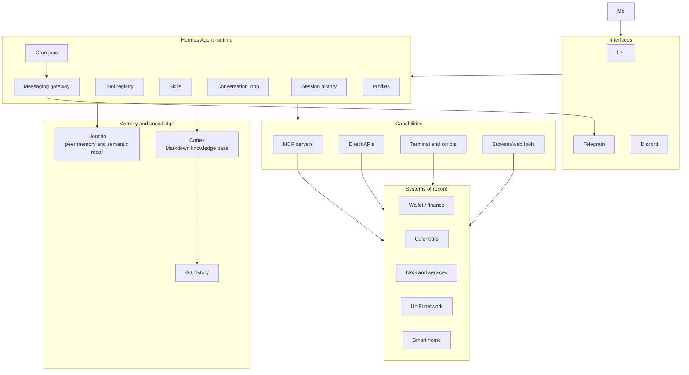
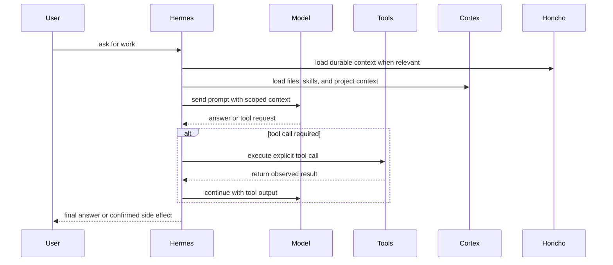

# Building a local-first personal AI agent stack

I do not want an AI assistant because I believe a chatbot should become my best friend. I want one because I am lazy in a very specialized way.

I want the boring things handled. I want the repetitive checks done. I want notes updated, calendars summarized, research digested, media tracked, home infrastructure queried, and recurring workflows turned into something I do not have to manually reassemble every week since I can't build a habit to save my life.

That is the actual motivation.

The point is not to make an assistant that feels alive. The point is to make one that is useful. Usefulness, unfortunately, is not something you get by putting a nicer prompt in front of a model. A prompt can make a model sound better. It cannot give it memory, permissions, tools, logs, schedules, or a sane relationship with the filesystem.

A useful personal AI assistant is not one model and one prompt, but rather a layered system:

- a runtime for execution
- memory for continuity
- skills for learned procedures
- local files for durable knowledge
- tools for access to real systems
- schedulers for ambient work
- permissions for safety
- logs for accountability

The model is the reasoning engine inside that system but it isn't the entire system. So, in short, the **LLM** is the **CPU**, and the architecture is the computer.

That distinction matters because most AI assistant demos still treat the model as the product and I think that is backwards. The product is the architecture around the model: how it gets context, where it stores state, what it can touch, what it must ask before doing, and how you debug it when it inevitably does something weird.

## Chatbots are not agents

A chatbot, in its essence, answers questions; where an agent operates against a given state. This sounds like a minor difference until the assistant can read files, call APIs, run shell commands, send messages, update notes, inspect system metrics, schedule future work, or mutate external systems. At that point it is no longer a text box, but an operator sitting next to your infrastructure and that's as mission critical as it gets.

> That operator might be helpful. It might also be wrong with high confidence.

So the design problem changes. You stop asking only "which model should I use?" and start asking more useful questions that go beyond the paradigm of simply picking the right flavour:

- What is the source of truth?
- What state is durable?
- What state is temporary?
- Which tools are read-only?
- Which tools can mutate things?
- What requires confirmation?
- Where do logs live?
- How do I recover from a bad action?
- Can I inspect what happened later?
- Can I swap the model without rebuilding the rest of the system?

This is where the architecture starts looking less like a chat app and more like systems software, mostly because of its side effect potential. So, repeat with me, an agent with shell access is not a simple chatbot!

## Design goals

The stack I use is built around a few principles.

First, local files should win whenever they can. Markdown notes, Git history, plain scripts, JSON caches, and normal logs are not pretty, but they survive time, which is why I've never bought into storing notes in anything other than text files (`.md` included). If the AI layer disappears tomorrow, I still want my notes, drafts, research, and operational history to be readable. Also, if I want to, I want to be able to build the entire thing again with a different stack.

Second, live systems should be queried through explicit tools and APIs. If there is an API, use the API. If there is an MCP server, use the MCP server. Browser automation is useful, but it is also a pile of timing assumptions wearing a trench coat and I f..... hate that with the force of a thousand suns.

Third, memory needs boundaries. Not everything belongs in long-term memory. A preference may belong there. A stable environment fact may belong there. A temporary task, a PR number, a one-off reminder, or some emotional noise from a random Tuesday usually does not. Memory shouldn't grow in a constant line, it should be reviewed and made concise, periodically.

Fourth, repeated procedures should become reusable procedures. If I correct the assistant three times on how to do something, the answer is not "hope it remembers next time." The answer is to turn that workflow into a skill. Hermes actually does this super well!

Fifth, scheduled work should be deterministic when possible. If a script can fetch calendar data, cache it, and render a briefing, I do not need to put a language model in that path just so it can invent a new failure mode. LLMs are useful for synthesis and judgment, but they are not required for every cron job. Not every scheduled task needs a stochastic parrot in the loop, most are actually trivial boring work that can be done with a simple script (get the AI to code it)

Finally, destructive actions need friction. The assistant can be fast without being reckless. Autonomy is a dial here, although I'm still tweaking this part.

## The architecture at a glance

The stack has five main layers:

Hermes is the runtime. It owns the conversation loop, tool registry, skills, gateway, cron scheduler, profiles, delegation, and model routing.

Honcho is the memory and identity layer. It stores durable conclusions, peer representation, and semantic recall beyond the current prompt window.

Cortex is the knowledge base. It is an Obsidian vault backed by Markdown and Git. Long-form notes, drafts, reviews, research, daily notes, and canonical pages live there.

MCP and other tools are the capability boundary. They expose finance data, filesystem access, terminal access, web access, home infrastructure, and other integrations through explicit calls.

Cron and the messaging gateway make the system ambient. I can interact through the CLI when I want precision, or through Telegram when I want a briefing, a reminder, or a quick query from somewhere else. Discord is a work in progress for me, as it can push messages into multiple channels, which is good if you have your own discord server, for example.

The useful split is simple:

- Hermes executes.
- Honcho remembers.
- Cortex preserves.
- Tools connect.
- Cron repeats.

That is most of the architecture.

## Hermes: the runtime

Hermes is the agent runtime I use. I think of it less as "the assistant" and more as the process supervisor for the assistant. I tried Clawdbot as well, it's complicated and a security hell hole, I prefer this one and I'll keep using it until I find something better for my use case(s).

It handles the loop:

1. build the prompt
2. call the model
3. inspect tool calls
4. execute tools
5. feed tool results back into context
6. continue until there is an answer or the task is done

That loop is the boring center of most agent systems. Hermes has provider-agnostic model routing, which means the rest of the architecture is not welded to one model vendor. The assistant can use OpenAI, Anthropic, OpenRouter, local models, or custom endpoints depending on configuration. That matters, because models change quickly, but the infrastructure should not have to.

Hermes also has toolsets. A session may have access to terminal tools, file tools, browser tools, web search, memory, scheduled jobs, messaging, MCP servers, wallet finance tools, and so on. Tool access is explicit. That is important because a tool is a capability and those should be gated by human supervision and permission.

There are profiles as well. Profiles isolate configuration, sessions, skills, and memory. This gives you separate userlands for different operating modes. A profile for one context does not need to inherit every habit, tool, and memory from another. It also allows other users to communicate with your agent(s).

Then there is the gateway. The same agent can run in the terminal and on messaging platforms like Telegram or Discord. This is more important than it sounds. CLI is excellent when I am working directly. Telegram is excellent when I want a briefing, a reminder, or a quick query from somewhere else.

Hermes also supports cron jobs. That turns the assistant from reactive to ambient. Instead of only answering when prompted, it can run scheduled tasks: fetch data, render briefings, send reminders, summarize research, check local systems, or trigger a workflow.

The runtime metaphor is useful. Tool calls are syscalls. Skills are installed procedures. Profiles are isolated userlands. And Cron is cron, what else...

Hermes is not the assistant. Hermes is the runtime that lets the assistant to come to fruition.

## Honcho: memory and identity

Most "AI memory" systems make me nervous. They often mean "we stuffed text into a vector database and hope vibes emerge." That can work for retrieval, but it is not memory governance. It's also way too complicated for my peanut brain; remember I'm lazy and I don't want to deal with extra complexity.

Honcho fills a different role in this stack. It gives the assistant continuity across sessions by storing peer representations, durable conclusions, and semantic context. It can maintain a profile of the user, a profile of the assistant, and recalled observations about the system architecture.

That does not mean everything gets remembered.

The stack distinguishes between several kinds of state:

| State | What it is for |
|---|---|
| Current prompt | The immediate task and loaded context |
| Session history | What happened in a specific conversation |
| Session search | Finding previous conversations later |
| Honcho memory | Durable facts and identity-level context |
| Skills | Reusable procedures |
| Cortex | Human-readable long-form knowledge |
| External APIs | Current truth from live systems |

This distinction matters. If you put everything into long-term memory, memory becomes landfill. If you put everything into the prompt, the context window becomes huge. If you rely on the model to infer live state from old text, you have stale cache invalidation.

Good memory is curated.

Things that belong in memory:

- stable user preferences
- durable environment facts
- long-lived constraints
- repeated patterns
- identity-level context

Things that usually do not:

- temporary task progress
- branch names
- PR numbers
- one-off events
- stale operational facts
- raw private journal entries

The assistant can remember that I prefer local-first Markdown and least-privilege defaults. It should not permanently remember every half-finished task unless that task belongs in a project note or todo system.

Memory is useful only if it is curated. Otherwise it becomes food for hallucinations.

## Skills: procedural memory

Facts are not procedures.

This is one of the places where agent systems often blur concepts together. A memory saying "the user uses Obsidian" is not the same as a procedure for creating, linking, indexing, and logging a new Cortex note. One is a fact. The other is operational knowledge.

Hermes skills are procedural memory. A skill is a reusable playbook that can include trigger conditions, exact commands, known pitfalls, verification steps, and project-specific conventions.

In this setup, skills cover things like:

- operating Cortex and Obsidian notes
- using the Wallet finance MCP
- managing media backlog entries
- turning voice reviews into structured notes
- GitHub workflows
- debugging procedures
- test-driven development
- home infrastructure operations
- Hermes configuration itself

The point is not to make the model "remember harder." The point is to stop relying on accidental prompt residue. When a workflow repeats, write it down as a skill. Then load that skill when the task appears again.

That is dull. Dull is good. Dull is how systems become reliable. KISS. Skills are there to stop making prompt history a database.

## Cortex: the local-first knowledge base

Cortex is my Obsidian vault inside a Git repository. It is where long-form knowledge goes.

This is deliberately separate from agent memory. Cortex is not just another memory backend for the assistant. It is the human-owned knowledge substrate. Markdown is the storage format. Obsidian is the UI. Git is the history and rollback mechanism.

That gives the system a few useful properties:

- Notes are readable without the assistant.
- Changes are reviewable as diffs.
- The knowledge base can be backed up, branched, reverted, and searched.
- The assistant can contribute without becoming the only way to access the content.

Cortex has a schema. Canonical pages live under concepts, entities, comparisons, queries, and projects. There are area notes for ongoing responsibilities like homelab, finance, learning, work, health, and home. Daily notes act as a low-friction write-ahead log. Raw sources are preserved separately. Reviews and media backlog entries use their own structure.

The important part is ownership. If the AI disappears tomorrow, the knowledge should still be useful.

That principle avoids a lot of nonsense. The assistant can summarize research into Cortex, update a project note, add a media review, or append to a daily note. But the result is still a normal file. I can open it in Vim, Obsidian, VS Code, or whatever other editor has not yet decided it needs an AI side panel and a login screen.

## MCP and tools: the capability boundary

MCP is useful because it gives the assistant structured access to external systems. Tools have schemas. Capabilities can be discovered. Permissions can be scoped. The assistant does not need a custom one-off integration for every service.

In this stack, the Wallet by BudgetBakers integration is a good example. Wallet data is exposed through official MCP tools. The assistant can query accounts, budgets, categories, records, labels, and aggregations without scraping the web app or exporting the whole financial dataset into some cursed CSV ritual.

The read-only default matters. Finance data is sensitive. I want analysis, summaries, and questions answered. I do not want a model casually rewriting financial records unless I explicitly ask for that and the permissions allow it.

The same principle applies elsewhere. Network equipment, NAS metrics, calendars, smart-home controls, and GitHub repositories should be exposed through narrow tools with clear behavior.

MCP helps with that, but it is not magic. Security is imperative here, and hard to achieve sometimes.

## Cron: ambient automation

The system becomes much more useful when it does not wait for me to ask everything manually.

Hermes cron jobs handle scheduled work, where some jobs are model-driven and others are script-first. For deterministic tasks, scripts are better. For instance, my calendar briefing flow is an example:

1. Read private ICS feeds.
2. Cache the parsed data locally.
3. Render a deterministic daily briefing.
4. Deliver it through Telegram.
5. Include Cortex daily-note reminders.

A model can help with synthesis where needed, but it does not need to be in the critical path for fetching and rendering known data. Deterministic input should have deterministic handling.

This entire philosophy is not anti-AI, it's being sensible to the potential of the tools we already had. Deterministic behavior should always be the goal.

Cron also handles reminders and recurring workflows. A pre-vacation reminder belongs in cron. A daily research digest belongs in cron. Infrastructure checks can belong there too, depending on how noisy they are. The rule I keep coming back to: use LLMs for judgment, synthesis, and language; use scripts for deterministic machinery.

## Personal infrastructure as an operating surface

The assistant becomes more useful when it can see the same systems I already care about.

In my case, that includes:

- a UniFi UDM Pro for network status, clients, topology, and anomalies
- a Synology NAS for storage and self-hosted services
- Prometheus and Grafana for metrics and observability
- Wallet by BudgetBakers for finance data
- private ICS feeds for calendars
- Cortex for notes and knowledge
- Telegram and Discord for messaging surfaces
- selected smart-home devices where control makes sense (by the way, this freaking thing hacked into my Roomba and made it beep!)

I still manually check all these systems, having an assistant synthesize information for me is just useful, but I still want Prometheus to scrape metrics; I still want Grafana to render dashboards; I still want UniFi to own the network; I still want Synology to run its services. The assistant should query, summarize, connect dots, and help operate, but it should not become the source of truth for everything, or anything for that matter.

## Security and trust boundaries

Any article about a personal agent with terminal, filesystem, network, finance, and messaging access needs a security section. Otherwise it is just an incident report.

The security model here is mostly about blast-radius reduction:

- Prefer read-only integrations first.
- Use scoped accounts where possible.
- Keep secrets in environment/config files, not notes.
- Require confirmation for destructive actions.
- Keep finance access read-only unless there is a deliberate reason to change it.
- Use private calendar feeds instead of broad cloud API access when read-only calendar data is enough.
- Keep Cortex changes reviewable through Git.
- Use profiles to isolate contexts.
- Keep memory curated.

There are tradeoffs everywhere.

Gateway access is convenient, but it expands the interaction surface. Long-term memory is useful, but it can preserve bad assumptions. Tool access makes the assistant useful, but every tool increases blast radius. Automation reduces toil, but it can also repeat mistakes on a schedule with cron.

This is why I do not think "fully autonomous" is a useful goal by itself. Full autonomy for what? Reading notes? Fine. Deleting data? Absolutely not. Moving money? Different conversation. Restarting services? Depends which service and what evidence it has that it should be restarted.

Autonomy should be scoped to the operation and YOLO mode is not a security model.

## Human in the loop

I still want to be in the loop for anything high-impact.

That does not mean the assistant has to ask before every read operation or every harmless note edit. Too much confirmation turns automation into bureaucracy with a progress spinner. But high-impact operations need my approval, I am **still** the boss after all:

- deleting files
- changing financial records
- modifying infrastructure
- pushing code
- sending messages that matter
- changing persistent memory
- touching credentials

The system should make routine things easy and dangerous things explicit.

The nice part about local-first state is that review is normal. Cortex changes show up as Git diffs, logs exist, sessions can be searched, cron jobs can be listed, tool outputs are visible and if/when something goes wrong, I can usually reconstruct the state machine.

## What goes where

This is the table I wish more agent projects had before they started adding features.

| Layer | Stores | Use it for |
|---|---|---|
| Prompt context | Current task, loaded skills, immediate instructions | Short-term reasoning |
| Session history | Conversation transcript | Reconstructing a specific interaction |
| Session search | Indexed past conversations | Finding old decisions or context |
| Honcho | Durable facts, identity, stable preferences | Continuity across sessions |
| Skills | Procedures, commands, pitfalls | Repeated workflows |
| Cortex | Notes, drafts, research, reviews, projects | Human-readable durable knowledge |
| External APIs | Live system state | Current truth |
| Scripts/cache | Deterministic intermediate data | Reliable scheduled jobs |

The rule is simple: do not make the model infer state that a file, API, or database can provide deterministically.

## Observability and debugging

If the assistant is infrastructure, it needs inspection points.

For this stack, that means:

- Hermes session history
- session search
- gateway logs
- cron job definitions and outputs
- tool call outputs
- Git diffs in Cortex
- local scripts and caches
- Prometheus/Grafana for home infrastructure

This is not glamorous, but it is necessary. You cannot operate what you cannot inspect. This applies to agents too, despite the industry's heroic commitment to vibes.

The important habit is verification. If the assistant writes a file, read it back. If it changes a repo, check the diff. If it says a command succeeded, inspect the status. If it sends data somewhere, verify the target.

## A normal day with the stack

The useful version of this system is not dramatic, it's good enough for me though.

In the morning, scheduled jobs fetch calendar data from private ICS feeds, render a briefing, and deliver it to Telegram. The briefing can include daily-note reminders from Cortex.

During the day, I can ask the assistant questions from the CLI or Telegram. It can search prior sessions, inspect files, update notes, query Wallet data, or check home infrastructure state.

If I ask it to do something repeated, the workflow can become a skill. If it learns a stable preference, that can become memory. If it produces durable synthesis, that goes into Cortex. If the task should recur, it becomes a cron job.

That loop is the point:

- facts become memory
- procedures become skills
- knowledge becomes notes
- recurring work becomes schedules
- live truth stays in the systems that own it

The assistant is useful because it routes information to the right layer instead of stuffing everything into a prompt and hoping the next completion behaves.

## Failure modes

This architecture still fails. It just fails in ways I can usually inspect.

The most dangerous failure is misplaced confidence. The assistant can sound certain while operating on stale memory, partial tool output, or a wrong assumption. That is why I care about explicit sources of truth. Live state should come from live tools. Durable knowledge should live in files and procedures should live in skills.

Memory should store only what deserves to survive.

There is also the normal entropy of personal infrastructure. Every integration is a dependency and every dependency has opinions. Some of those opinions were written into firmware by people who should have taken a walk first, it is what it is and we deal with it.

The answer is not to avoid integrations but keep them boring, inspectable, and scoped.

## Lessons learned

The strongest lesson is that personal agents are not primarily a model problem. They are a systems problem.

The model matters, obviously... Better reasoning, larger context, better tool use, and lower latency all help. But the surrounding architecture determines whether the model has the right context, the right tools, the right constraints, and a safe place to put results.

The practical lessons are boring, which is usually how you know they are real:

- Prefer APIs over browser automation.
- Prefer read-only access before write access.
- Prefer local files for durable knowledge.
- Prefer Git for review and rollback.
- Prefer scripts for deterministic scheduled work.
- Prefer skills over repeated prompt correction.
- Prefer explicit memory over accidental memory.
- Prefer logs over trust.
- Verify side effects.
- Keep humans in the loop for destructive operations.

That is less exciting than a "fully autonomous AI employee." It is also less likely to delete your notes, leak your secrets, or schedule a task that quietly fails for three weeks because the OAuth token expired and nobody checked the logs.

I will take boring and useful over magical and fragile every day.

## Conclusion

Hermes gives me the runtime. Honcho gives me continuity. Cortex gives me durable human-readable knowledge. MCP and tools give me controlled access to real systems. Cron makes useful work happen without waiting for a prompt. Git, logs, and explicit permissions keep the whole thing from turning into folklore.

The model is still important. It reasons, writes, summarizes, plans, and chooses tools. But it is only one component.

The architecture is what makes the assistant useful.

That is the part I care about. Not because it is flashy. Because it works. And because if a shell script, a Markdown file, and a scoped API token solve the problem, I would rather not summon twelve microservices and a pitch deck.

## The parts this article only sketches

This article is the architecture map, not the full operating manual. A few pieces deserve more context because they are where the system stops being abstract and starts touching real life.

The homelab side is the physical substrate: the UniFi network, the NAS, the services running on it, the monitoring scripts, the dashboards, and the mild paranoia that comes from letting software talk to devices in your house. That deserves its own treatment because local-first does not mean "runs on my laptop and vibes." It means the machine has to survive DNS weirdness, expired certificates, flaky consumer firmware, power events, Docker containers with opinions, and the occasional vendor API that appears to have been designed at lunch time.

The learning workflow is a separate thread too. Cortex is not just storage for finished notes but where research digests daily notes, reading, experiments, and stray ideas get converted into something stable enough to reuse. The useful pattern is not "the agent remembers everything.". The useful pattern is capture first, promote deliberately, and let the assistant help with the boring parts of synthesis.

Finance is another example of why boundaries matter. The Wallet integration is intentionally boring: read data through the official MCP server, aggregate spending, answer questions, and avoid pretending a language model should be trusted with destructive financial actions by default (obviously this has no write access to anything bank related). The interesting part is not categorizing a transaction with AI fairy dust, but rather putting a useful analytical layer on top of existing financial data while keeping the source of truth outside the model.

The daily review flow is where the architecture becomes ambient. Calendar summaries, reminders, media backlog updates, research digests, and maintenance notes are all awesome and improve my day to day. They are small recurring loops; each one is mundane on its own, but together they turn the assistant from a thing I ask questions into a background process that keeps the personal operating system from accumulating too much entropy.
